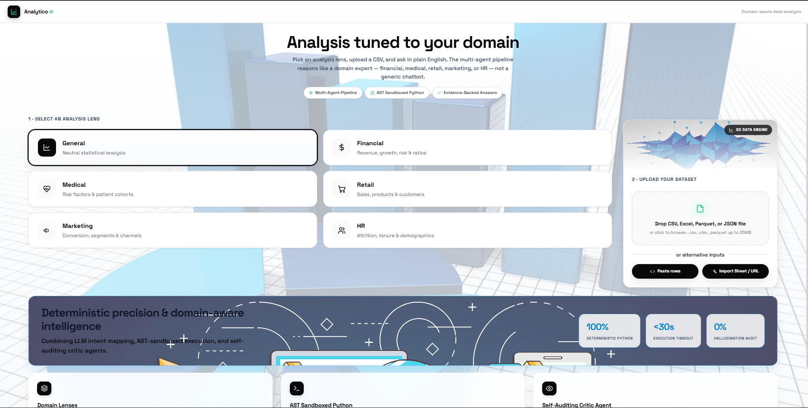
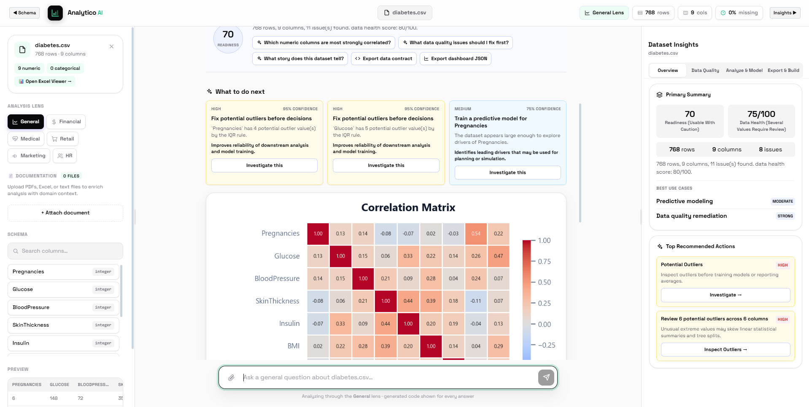
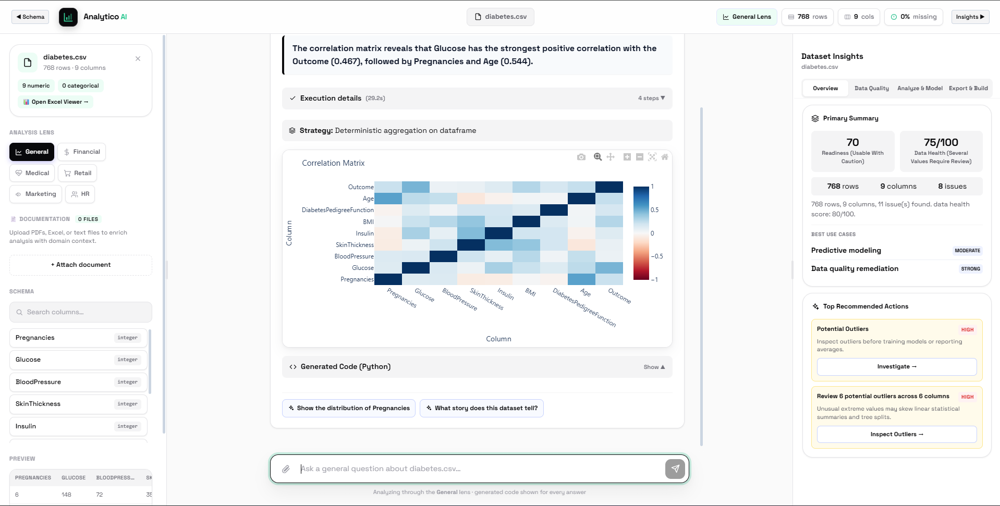
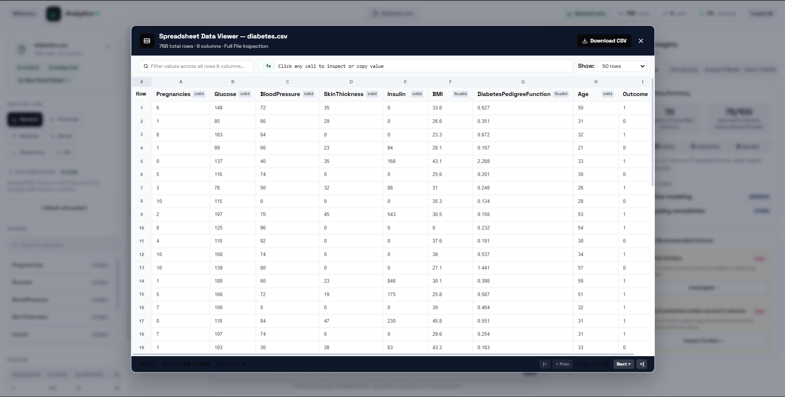

# Analytico AI

Analytico AI is an AI data-analysis workbench for CSV, Excel, Parquet, JSON, pasted table data, and Google Sheets imports. Upload a dataset, choose a domain lens, and ask questions in plain English. The app profiles the data immediately, streams an evidence-backed analysis plan, executes deterministic pandas/SQL-style calculations when possible, generates interactive charts, and produces reports, data contracts, cleaning plans, forecasts, models, and scenario simulations.

The project is built for a hackathon-grade demo with production-minded guardrails: FastAPI SSE streaming, React + Vite, Gemma 4 reasoning, deterministic query routes for common analytics tasks, sandboxed generated Python, local document retrieval, structured validation, and broad backend/frontend test coverage.

## Screenshots

### Domain-aware upload flow



### Dataset profile, recommended actions, and insight dashboard



### Streamed answer with chart, execution details, and generated code



### Spreadsheet data viewer



## What It Does

- Upload and profile tabular data from CSV, Excel, Parquet, JSON, pasted rows, or a Google Sheets URL.
- Ask natural-language questions about the dataset and receive streamed answers over Server-Sent Events.
- Use domain lenses for General, Financial, Medical, Retail, Marketing, and HR analysis.
- Get an instant dataset health score, readiness score, schema summary, missingness profile, column roles, preview rows, and recommended actions.
- Run deterministic analytics for common questions such as row lookup, employee/entity lookup, rankings, totals, averages, correlations, quality checks, outliers, duplicates, missing values, and extreme values.
- Fall back to a Gemma 4 multi-agent workflow for more open-ended questions.
- Generate interactive Plotly charts and static base64 PNG charts for streamed responses and exports.
- Show execution details, generated Python, validation metadata, evidence facts, route badges, and follow-up questions.
- Upload supporting documents for retrieval-augmented analysis using local HashingVectorizer retrieval.
- Build data-quality reports, cleaning plans, cleaned CSV exports, data contracts, dashboard blueprints, and decision briefs.
- Train explainable predictive models with scikit-learn, SHAP, permutation importance, partial dependence, and model metadata.
- Predict a new row, run what-if scenarios, parse natural-language scenario prompts, and visualize scenario impact.
- Run time-series forecasts, compare datasets, infer joins, join related datasets, export PDF/PPTX reports, and benchmark the analyst pipeline.

## Core Experience

1. Pick an analysis lens.
2. Upload data or paste/import rows.
3. Review the automatically generated profile, quality report, recommended actions, and dashboard suggestions.
4. Ask a question in plain English.
5. Watch the backend stream planning, execution, charting, validation, and final answer events.
6. Inspect evidence, generated code, charts, tables, and follow-up prompts.
7. Export cleaned data, contracts, dashboards, or business reports when needed.

## Architecture

```text
React + Vite frontend
  |-- Upload, paste, URL import, spreadsheet viewer
  |-- Chat interface with SSE streaming
  |-- Dataset insight panels and Plotly charts
  |-- Prediction, simulation, report, and export controls

FastAPI backend
  |-- Upload/profile/session layer
  |-- Deterministic analytics router
  |-- Gemma 4 planning and synthesis pipeline
  |-- Sandboxed pandas execution
  |-- Plotly/matplotlib chart generation
  |-- Local document retrieval
  |-- Model training, forecasting, report exports, jobs

JSON + SSE API contract
  |-- No plain-text API responses
  |-- Base64 chart/report payloads where binary output is needed
```

## Multi-Agent Query Pipeline

Analytico AI uses a hybrid approach:

- Deterministic routes answer high-confidence questions directly from pandas, including row/entity lookup, metric lookup, quality audits, ranking, scalar extremes, aggregation, correlation, and median comparison.
- Gemma 4 planning handles broader analytical questions by mapping the user's intent to schema-aware operations.
- A critic/validation layer checks whether answers are grounded in the computed evidence.
- If written synthesis fails but calculations succeeded, the UI can show a partial result with evidence instead of losing the whole analysis.
- Retry-answer support can regenerate only the written explanation from cached deterministic evidence.

This keeps simple facts fast and reliable while still allowing open-ended data-analysis conversations.

## Feature Map

| Area | Features |
|---|---|
| Uploads | CSV, XLSX, Parquet, JSON, pasted CSV/TSV, Google Sheets URL import |
| Profiling | schema, preview, missingness, duplicates, outliers, column roles, readiness and health scores |
| Insights | proactive findings, recommended actions, best-use-case detection, decision brief |
| Querying | SSE streamed analysis, deterministic lookups, ranking, aggregation, chart requests, free-form reasoning |
| Charts | Plotly JSON, static PNG/base64, correlation heatmaps, bars, lines, scatter, distribution charts |
| Data quality | quality report, cleaning plan, cleaned CSV export, contract generation, row validation |
| Documents | PDF, Excel, Markdown, text, and CSV documentation upload for local retrieval |
| Modeling | random forest training, classification/regression support, SHAP, permutation importance, PDP |
| Scenarios | predict new cases, what-if changes, natural-language scenario parsing, impact charts |
| Time series | automatic forecast workflow with date/target columns and configurable periods |
| Dataset ops | compare datasets, infer join keys, join datasets |
| Reports | PDF/PPTX report export with charts and conversation context |
| Reliability | job polling, query caching, provider health check, partial answer recovery, structured validation |

## Tech Stack

| Layer | Technology |
|---|---|
| Frontend | React 18, Vite, Plotly |
| Backend | FastAPI, uvicorn, pandas, numpy |
| LLM | Google Gemma 4 through the `google-genai` SDK |
| Retrieval | Local `sklearn.feature_extraction.text.HashingVectorizer` |
| ML | scikit-learn, SHAP, statsmodels |
| Charts | Plotly, matplotlib, seaborn, kaleido |
| Reports | reportlab, python-pptx |
| File parsing | openpyxl, pyarrow, pypdf |
| Tests | pytest, pytest-asyncio, Vitest, React Testing Library |

## Local Setup

### Prerequisites

- Python 3.11+
- Node.js 18+
- A Google AI Studio API key

### Backend

```powershell
cd D:\Codex_Meetup\csv-analyst-gemini\backend
python -m venv .venv
.\.venv\Scripts\activate
pip install -r requirements.txt
```

Create `backend\.env`:

```env
GEMMA_API_KEY=your_key_here
# GEMINI_API_KEY is also supported for compatibility.
```

Start the backend:

```powershell
uvicorn main:app --reload --port 8001
```

### Frontend

```powershell
cd D:\Codex_Meetup\csv-analyst-gemini\frontend
npm install
npm.cmd run dev
```

Open:

```text
http://localhost:5174
```

The frontend uses Vite proxy routes such as `/upload`, `/query`, `/predict`, and `/report`, so local API calls do not hardcode backend ports inside React components.

## Useful Commands

```powershell
# Backend tests
cd D:\Codex_Meetup\csv-analyst-gemini
python -m pytest backend -q

# Frontend tests
cd D:\Codex_Meetup\csv-analyst-gemini\frontend
npm.cmd test -- --run

# Frontend production build
cd D:\Codex_Meetup\csv-analyst-gemini\frontend
npm.cmd run build
```

## Environment Variables

| Variable | Purpose | Default |
|---|---|---|
| `GEMMA_API_KEY` | Preferred API key for Gemma/Gemini-compatible Google AI access | required for LLM calls |
| `GEMINI_API_KEY` | Backward-compatible API key name | optional |
| `GEMMA_MODEL` | Primary model | `gemma-4-31b-it` |
| `PLANNER_MODEL` | Planner model | `gemma-4-26b-a4b-it` |
| `SYNTHESIS_MODEL` | Answer synthesis model | `gemma-4-26b-a4b-it` |
| `DEEP_ANALYSIS_MODEL` | Deeper analysis model | `gemma-4-31b-it` |
| `ALLOWED_ORIGINS` | CORS origins | `*` |
| `MAX_UPLOAD_BYTES` | Upload size limit | `26214400` |
| `MAX_DATAFRAME_ROWS` | Row limit | `100000` |
| `MAX_DATAFRAME_COLUMNS` | Column limit | `200` |
| `SESSION_TTL_SECONDS` | In-memory session lifetime | `14400` |
| `LLM_CALL_TIMEOUT_SECONDS` | LLM call timeout | `15.0` |

Never commit real API keys. Keep them in `backend\.env` or your deployment provider's secret store.

## API Overview

FastAPI docs are available at:

```text
http://localhost:8001/docs
```

| Method | Path | Description |
|---|---|---|
| `GET` | `/health` | Backend health check |
| `GET` | `/health/provider` | LLM provider connectivity status |
| `POST` | `/upload` | Upload a dataset file |
| `POST` | `/upload_text` | Upload pasted CSV/TSV text |
| `POST` | `/import_url` | Import a safe Google Sheets/CSV URL |
| `GET` | `/dataset_rows/{session_id}` | Page, search, sort, and inspect uploaded rows |
| `POST` | `/upload_doc` | Attach supporting documents for retrieval |
| `GET` | `/docs/{session_id}` | List attached documents |
| `POST` | `/query` | Ask a dataset question over SSE |
| `POST` | `/query/{request_id}/retry-answer` | Regenerate explanation from cached evidence |
| `POST` | `/cancel/{request_id}` | Cancel a running query |
| `POST` | `/investigate` | Run an autonomous investigation over SSE |
| `POST` | `/story` | Generate a fact-first dataset story |
| `GET` | `/quality/{session_id}` | Data-quality report |
| `GET` | `/brief/{session_id}` | Decision brief |
| `GET` | `/cleaning_plan/{session_id}` | Cleaning plan |
| `POST` | `/clean/{session_id}` | Cleaned CSV export payload |
| `GET` | `/contract/{session_id}` | Data contract |
| `POST` | `/validate_rows/{session_id}` | Validate new rows against the contract |
| `GET` | `/dashboard/{session_id}` | Dashboard blueprint JSON |
| `POST` | `/predict` | Train a predictive model over SSE |
| `POST` | `/predict_job` | Queue model training |
| `GET` | `/model_info/{session_id}` | Trained model metadata |
| `POST` | `/predict_input` | Predict one new case |
| `POST` | `/simulate` | Run what-if scenario simulation |
| `POST` | `/scenario_parse` | Parse a scenario prompt into structured changes |
| `POST` | `/forecast` | Build a time-series forecast |
| `POST` | `/compare` | Compare two datasets |
| `POST` | `/infer_join` | Infer likely join keys |
| `POST` | `/join` | Join two uploaded datasets |
| `POST` | `/report/{session_id}` | Export PDF or PPTX report payload |
| `POST` | `/report_job/{session_id}` | Queue report generation |
| `GET` | `/benchmark/{session_id}` | Run benchmark questions |
| `POST` | `/benchmark_job/{session_id}` | Queue benchmark run |
| `GET` | `/jobs/{job_id}` | Poll background job status |

## Security and Reliability

- API responses are JSON or SSE.
- CORS stays open by default for local development.
- Uploaded data is bounded by file size, row count, and column count.
- Generated pandas code is AST-scanned before execution.
- Sandboxed execution uses restricted builtins and bounded result sizes.
- URL imports are guarded to reduce SSRF risk.
- Session tokens protect session-specific data access.
- Query cache keys include dataset fingerprints and pipeline version metadata.
- Deterministic evidence is cached so failed answer wording can be retried.
- Report and chart outputs are encoded as JSON/base64 payloads rather than raw binary streams.

## Repository Structure

```text
csv-analyst-gemini/
  backend/
    main.py                 FastAPI app, query pipeline, analytics endpoints
    core/                   shared config, schemas, error helpers
    llm/                    LLM client and synthesis helpers
    test_main.py            main backend endpoint and pipeline tests
  frontend/
    src/App.jsx             main React application
    src/__tests__/          frontend behavior tests
    vite.config.js          Vite dev server and API proxy
  sample_data/              datasets for local testing and demos
  screenshots/              README screenshots
  KAGGLE_SUBMISSION.md      competition writeup draft
  PROJECT_DOCUMENTATION.md  deeper technical documentation
```

## Deployment Notes

The app can be deployed as separate frontend and backend services.

- Backend: deploy `backend/` to a Python host such as Railway, Render, Fly.io, or a VM.
- Frontend: deploy `frontend/` to Vercel, Netlify, or any static hosting provider.
- Set `GEMMA_API_KEY` and production `ALLOWED_ORIGINS` in the backend environment.
- For production scale, replace in-memory sessions/jobs with Redis, a database, or object storage.

## License

MIT
